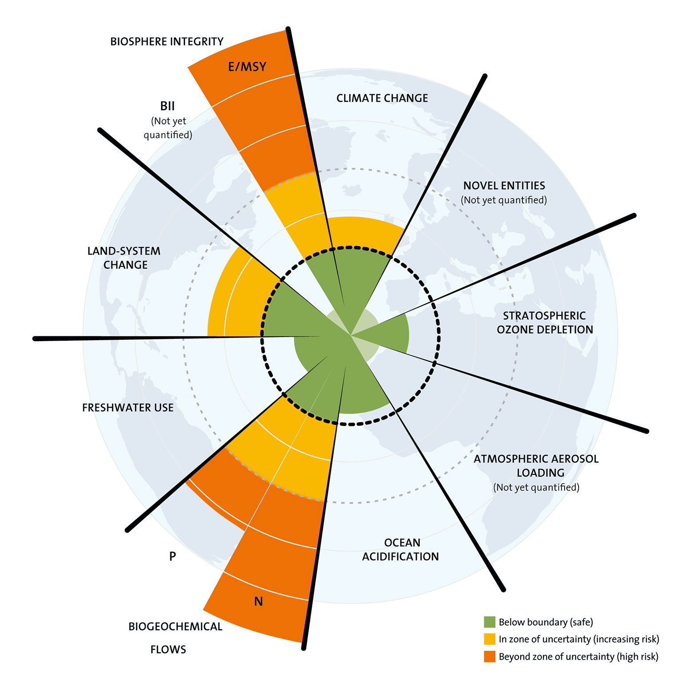
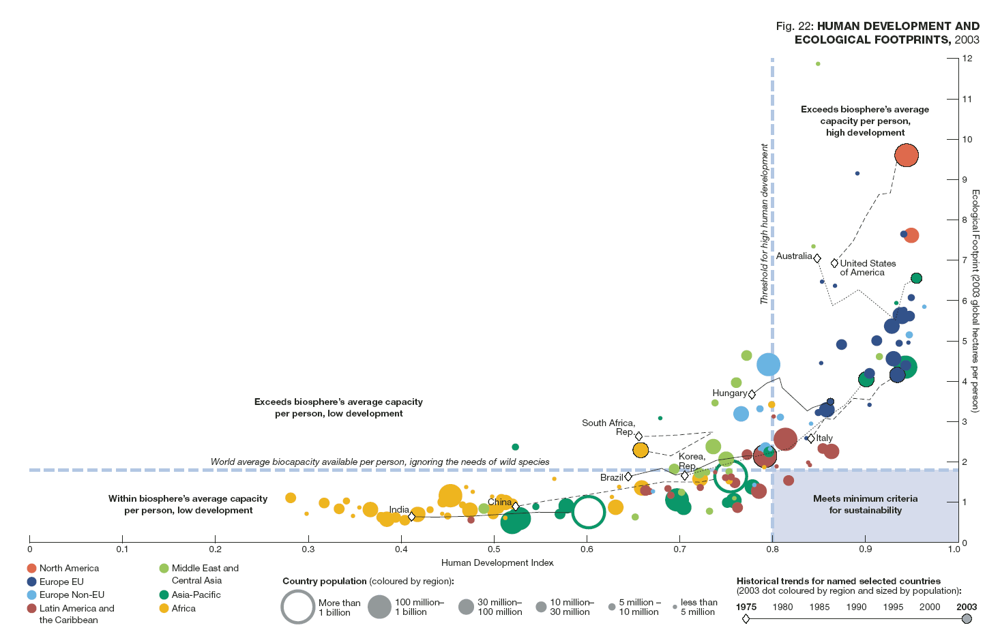

# Sustainability and Human Needs

This book is motivated by my teaching of an Environmental Sustainability class. 
I was constantly looking for ways to embed the environmental and sustainability issues
in the everyday experience of the students' lives.

The evidence is fairly clear that human activity 
is having a dramatic impact on the natural environment.
We are changing the climate on an unprecendet scale,
species are becoming extinct at apocalyptic rates,
we are alse disrupting many other natural cycles.

Two images tell this story most clearly for me.

The first 

